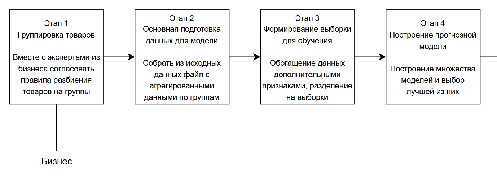
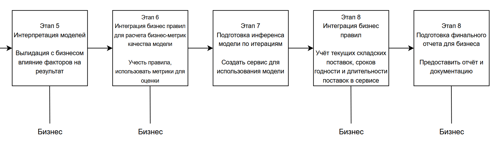

# ML System Design Doc - [RU]
Кейс №3 "Оптимизация управления товарными запасами и логистикой"

Состав команды:
- Кахикало Кирилл 334725
- Виктор Сергеев

Использован шаблон ML System Design Doc от телеграм-канала [Reliable ML](https://t.me/reliable_ml)*

### 1. Цели и предпосылки
#### 1.1. Зачем идем в разработку продукта?

Бизнес целью является оптимизация управления товарными запасами и логистикой путем точного 
прогнозирования спроса на товары в каждой точке продаж сети супермаркетов.

Благодаря внедрению машинного обучения получится уменьшить количество ошибок, которые совершает менеджер сейчас.
Уменьшение количества ошибок приведёт к снижению потерь на просроченные товары или упущенной выручки из-за
отсутствующих товаров на полках. Уменьшение потерь и увеличение выручки позволит увеличить прибыль компании
и получить положительные экономический эффект от внедрения машинного обучения.

Успехом итерации с точки зрения бизнеса будет считаться:
- Снижение потерь на просроченные товары на 10% в течение 3 месяцев после внедрения пилота.
- Увеличение выручки на 5% в течение 3 месяцев после внедрения пилота, за счёт снижения количества отсутствующих товаров на полках.

#### 1.2. Бизнес-требования и ограничения

- Краткое описание БТ и ссылки на детальные документы с бизнес-требованиями `Product Owner`
- Бизнес-ограничения `Product Owner`
- Что мы ожидаем от конкретной итерации `Product Owner`.
- Описание бизнес-процесса пилота, насколько это возможно - как именно мы будем использовать модель в существующем бизнес-процессе? `Product Owner`
- Что считаем успешным пилотом? Критерии успеха и возможные пути развития проекта `Product Owner`

#### 1.3. Что входит в скоуп проекта/итерации, что не входит
В эту итерацию входит создание простой модели, которая предскажет спрос на группы товаров в сети супермаркетов.
Входными данными для этой модели будут данные о продажах групп товаров в сети за последний месяц, а так же
дата дня, для которого мы хотим предсказать спрос. Модель должна предсказывать спрос на 7 дней вперёд с гранулярностью в день.

Входными данными для модели будет спрос на товары за последние 28 дней (для того чтобы учесть сезонность и тренды,
при этом ещё и учитывая еженедельную цикличность спроса), а так же день недели, неделя в году, месяц, праздник ли этот день.

Выходными данными для модели будет количество продаж в день на каждую группу товаров на следующие 7 дней в сети супермаркетов по дням.

Затем магазин умножает спрос на свою долю в выручке от группы товаров в сети супермаркетов, чтобы получить прогноз на конкретный магазин.

На этой итерации мы не можем создать модели, специализирующиеся на конкретных магазинах,
так как есть риск, что данных может не хватить, а так же из-за того, что это потребует намного больше времени на разработку,
чем разработка одной общей модели на все магазины.

Так же мы не сможем реализовать в этой итерации поддержку взаимозаменяемых групп товаров.
Для этого потребовалось бы провести отдельное исследование, для которого могли бы понадобиться дополнительные данные,
для того чтобы определить, как оптимально разбить товары на группы, которые будут взаимозаменяемыми.

На этой итерации мы не будем учитывать изменения цены и скидки на товары, так как это потребует дополнительного исследования,
и сбора дополнительных данных, так как одного года данных о продажах может быть недостаточно.

#### 1.4. Предпосылки решения
Для того чтобы иметь возможность использовать модель на практике нужно разбить товары на группы.
Это требуется так как ассортимент постоянно меняется и бизнесу нужно иметь возможность прогнозировать спрос даже на новые товары.
Группировка будет происходить по стоимости (low, medium, high) и по типу товара (молоко, кефир, шоколадные батончики и т.д.).
Группы стоит подбирать так, чтобы товары внутри них были примерно взаимозаменяемыми.
То есть, в одну группу не должно входить молоко и кефир, потому что хоть эти товары и относятся к молочным,
случаев когда клиент купит молоко вместо кефира или наоборот будет очень мало.

Наибольшая доля расходов на просроченные товары и упущенную выручку приходится на скоропортящиеся товары или товары с большим оборотом.
Поэтому в этой итерации мы будем использовать только данные о продажах скоропортящихся товаров и товаров с большим оборотом.
Для таких товаров точно будет достаточно данных, поэтому пилот должен в первую очередь быть сконцентрирован на них.
Средний срок поставок для таких продуктов от момента заказа до поступления в магазин составляет 3 дня,
что означает, что нужно иметь возможность предсказывать спрос на ~7 дней вперёд. Для того чтобы успеть совершить
заказ на товар, но при этом не делать заказы слишком часто. Увеличение срока предсказания более 7 дней позволит совершать
заказы реже, что позволит сэкономить на логистике, но при этом каждый дополнительный день будет иметь большую погрешность.
Поэтому для первой итерации решили выбрать срок в 7 дней вперёд с гранулярностью в день.

Бизнес говорит о том, что на спрос значительное влияние оказывают праздники, день недели, сезонность и близость
к датам выплаты зарплаты. Поэтому все эти факторы должны быть учтены в модели. При этом учесть скидки и изменения цен на товары
в модели не получится, так как это потребует дополнительных данных и исследований.

Бизнесу требовалось иметь собственную модель для каждого магазина по отдельности, но сейчас это не представляется возможным,
так как данных не хватает для того, чтобы обучить модель для каждого магазина. В будущем эту проблему можно было бы решить,
во-первых, большим объёмом данных, во-вторых, группировкой данных о магазинах по каким-то признакам, например,
количество жителей в радиусе 10 минут ходьбы, соотношение количества офисов и жилых помещений в радиусе 10 минут ходьбы и тд.
Это всё требует дополнительного исследования и времени.

Так как отсутствует возможность создать модель для каждого магазина в отдельности, а магазины могут сильно отличаться друг от друга
по размерам и структуре спроса, то после того как модель выдаст результат на всю сеть, его нужно будет дополнительно обработать.
Нужно будет учесть долю выручки магазина по конкретной группе товаров в сети супермаркетов. Это сделано для того,
чтобы во-первых, свести к минимуму влияние размера магазина, а во-вторых иметь возможность учитывать разную структуру спроса в разных магазинах.

### 2. Методология

#### 2.1. Постановка задачи
Необходимо создать модель с direct предсказанием спроса на группы товаров во всей сети супермаркетов на 7 дней вперёд с гранулярностью в день.
Это задача прогнозирования временных рядов, так как мы хотим предсказать спрос на товары в будущем.

#### 2.2. Блок-схема решения

#### 2.3. Этапы решения задачи
* Этап 1 - группировка товаров.

Необходимо с экспертами из бизнеса согласовать правила разбиения товаров на группы, для которых будет происходить прогнозирование.
Мы получаем примерный список групп товаров, затем делим их на группы по ценам, смотрим, чтобы не оказалось каких-то групп
с очень низким количеством товаров, в случае необходимости, объединяем их с другими группами.

* Этап 2 - основная подготовка данных для модели

| Название данных | Есть ли данные в компании (если да, название источника/витрин) | Требуемый ресурс для получения данных (какие роли нужны) | Проверено ли качество данных (да, нет) |
|-----------------| ------------- |----------------------------------------------------------|----------------------------------------|
| Продажи товаров | DATAMARTS_SALES  | System Administrator                                     | нет                                    |
| Группы товаров | нет | Data Engineer, Data Scientist, Product Owner | нет                                    |

На выходе мы должны получить файл с таблицей, в которой по датам и группам товаров будет указано количество продаж в день.
Нашей целевой переменной будет количество продаж в день по группам товаров, она же используется при обучении модели.

* Этапы 3 - формирование выборки для обучения

На этом этапе нужно обогатить исходные данные информацией о дне недели, неделе в году, месяце, праздниках, близости к датам выплаты зарплаты.

После этого нужно разбить данные на выборки для обучения, тестирования и валидации. Нужно убедиться, что в выборках данные по дню недели, неделе в году, месяцу и праздникам представлены равномерно.

* Этап 4 - Построение прогнозной модели

На этом этапе будут создаваться прогнозные модели, обучаться и затем сравниваться между собой, для того чтобы выбрать подход дающий наилучший результат.
Предполагается, что на каждую такую модель не должно быть выделено дольше 3-4 дней, чтобы не затягивать итерацию. 
После того как будет проверено 5-6 моделей, нужно будет выбрать 1-2 модели с наилучшим качеством и продолжить с ними.

На каждую из этих моделей стоит дополнительно выделить по неделе, для того чтобы проверить, что они дают стабильный результат и выбрать из них лучшую.

Есть риск, что никакая из моделей не даст достаточного качества, 
в этом случае нужно будет вернуться к этапу 3 и попробовать другие модели, 
или же вернуться к этапу 2 и попробовать по другому подготовить данные для обучения.

* Этап 5 - Интерпретация моделей
На этом этапе нужно будет проанализировать, какие факторы влияют на результат модели, и как именно они влияют.
Нужно провалидировать с заказчиком, что влияние факторов на результат модели соответствует ожиданиям бизнеса.
В случае если это не так, нужно дополнительно углубиться и проверить, действительно ли всё так.
Если факторы не влияют на результат модели или влияют не так как должны, то возможно стоит вернуться к предыдущему этапу.

* Этап 6 - Интеграция бизнес правил для расчета бизнес-метрик качества модели
На этом этапе нужно будет учесть длительность поставок товаров в магазины, учесть максимальную ёмкость склада, 
учесть максимальную длительность хранения по самым скоропортящимся товарам.
В качестве метрик можно выбрать долю просроченных товаров к общему количеству товаров, которые были заказаны в течение недели
и количество упущенной выручки из-за отсутствия товаров на полках.

На этом этапе дополнительно уточняем у бизнеса, что все необходимые ограничения учитываются в модели.

* Этап 7 - Подготовка инференса модели по итерациям
На этом этапе нужно будет подготовить инференс модели, который будет использоваться в бизнес-процессе.
Это может быть веб сервис, в базу данных которого раз в день будут записываться данные о поступивших товарах за предыдущий день.
Затем будет вызываться модель, которая будет предсказывать спрос на товары на 7 дней вперёд.

Будет существовать REST API эндпоинт, который будет принимать дату и идентификатор магазина и будет возвращать прогноз для этого конкретного магазина.

* Этап 8 - Интеграция бизнес правил
На этом этапе нужно будет в БД сервиса внести данные о вместимостях склада для каждого магазина и автоматически получать доступ к текущим запасам.
Так при обработке прогноза модели будет учитываться, что в магазине не может быть заказано больше товаров, чем может поместиться на складе и то, что какие-то товары там уже есть.

На этом этапе мы ещё раз проверяем с представителями бизнеса, что все бизнес-правила учтены в модели и что модель работает корректно.

* Этап 9 - Подготовка финального отчета для бизнеса
На этом этапе нужно будет подготовить финальный отчет для бизнеса, в котором будет описано, как работает модель, какие факторы влияют на результат,
какие метрики качества были использованы, как они были рассчитаны и какие результаты были получены.
Так же нужно предоставить документацию по сервису, который будет использоваться в бизнес-процессе, чтобы бизнес мог понять, как его использовать и какие данные ему нужны.

На этом этапе вся модель вместе с документацией будет передана в команду, которая будет заниматься её эксплуатацией и поддержкой.

### 3. Подготовка пилота

#### 3.1. Способ оценки пилота

- Краткое описание предполагаемого дизайна и способа оценки пилота `Product Owner`, `Data Scientist` with `AB Group`

#### 3.2. Что считаем успешным пилотом

Формализованные в пилоте метрики оценки успешности `Product Owner`

#### 3.3. Подготовка пилота

- Что можем позволить себе, исходя из ожидаемых затрат на вычисления. Если исходно просчитать сложно, то описываем этап расчетов ожидаемой вычислительной сложности на эксперименте с бейзлайном. И предусматриваем уточнение параметров пилота и установку ограничений по вычислительной сложности моделей. `Data Scientist`

### 4. Внедрение `для production систем, если требуется`

> Заполнение раздела 4 требуется не для всех дизайн документов. В некоторых случаях результатом итерации может быть расчет каких-то значений, далее используемых в бизнес-процессе для пилота.

#### 4.1. Архитектура решения

- Блок схема и пояснения: сервисы, назначения, методы API `Data Scientist`

#### 4.2. Описание инфраструктуры и масштабируемости

- Какая инфраструктура выбрана и почему `Data Scientist`
- Плюсы и минусы выбора `Data Scientist`
- Почему финальный выбор лучше других альтернатив `Data Scientist`

#### 4.3. Требования к работе системы

- SLA, пропускная способность и задержка `Data Scientist`

#### 4.4. Безопасность системы

- Потенциальная уязвимость системы `Data Scientist`

#### 4.5. Безопасность данных

- Нет ли нарушений GDPR и других законов `Data Scientist`

#### 4.6. Издержки

- Расчетные издержки на работу системы в месяц `Data Scientist`

#### 4.5. Integration points

- Описание взаимодействия между сервисами (методы API и др.) `Data Scientist`

#### 4.6. Риски

- Описание рисков и неопределенностей, которые стоит предусмотреть `Data Scientist`

> ### Материалы для дополнительного погружения в тему
> - [Шаблон ML System Design Doc [EN] от AWS](https://github.com/eugeneyan/ml-design-docs) и [статья](https://eugeneyan.com/writing/ml-design-docs/) с объяснением каждого раздела
> - [Верхнеуровневый шаблон ML System Design Doc от Google](https://towardsdatascience.com/the-undeniable-importance-of-design-docs-to-data-scientists-421132561f3c) и [описание общих принципов его заполнения](https://towardsdatascience.com/understanding-design-docs-principles-for-achieving-data-scientists-53e6d5ad6f7e).
> - [ML Design Template](https://www.mle-interviews.com/ml-design-template) от ML Engineering Interviews
> - Статья [Design Documents for ML Models](https://medium.com/people-ai-engineering/design-documents-for-ml-models-bbcd30402ff7) на Medium. Верхнеуровневые рекомендации по содержанию дизайн-документа и объяснение, зачем он вообще нужен
> - [Краткий Canvas для ML-проекта от Made with ML](https://madewithml.com/courses/mlops/design/#timeline). Подходит для верхнеуровневого описания идеи, чтобы понять, имеет ли смысл идти дальше.  
