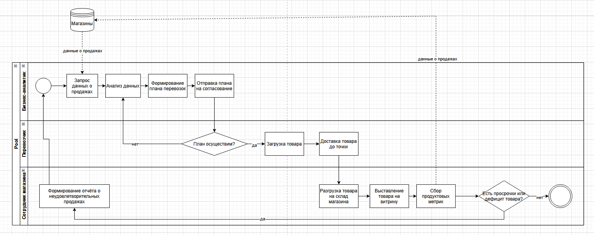
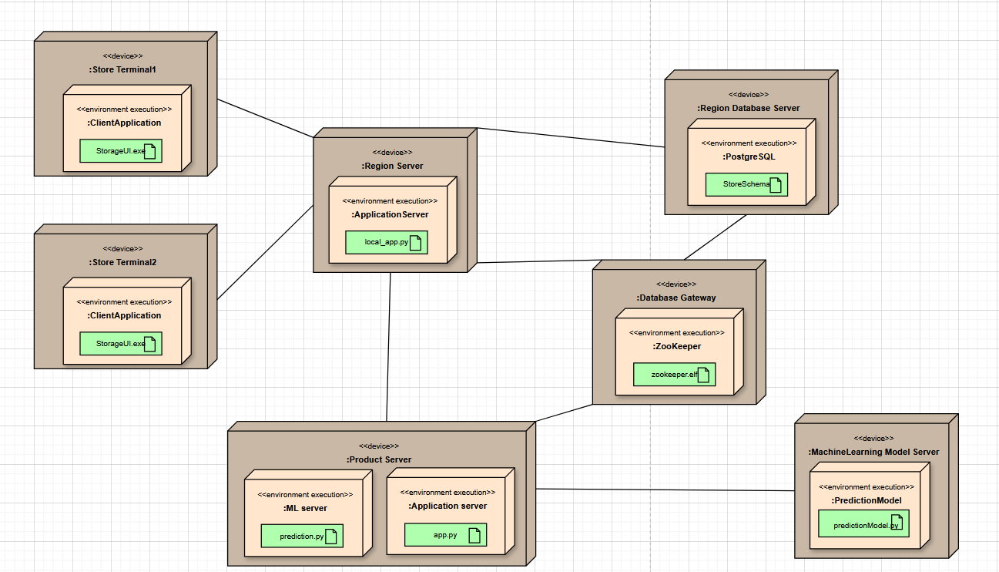

# ML System Design Doc - [RU]

Кейс №3 "Оптимизация управления товарными запасами и логистикой"

Состав команды:

- Кахикало Кирилл 334725
- Виктор Сергеев 367534

Использован шаблон ML System Design Doc от телеграм-канала [Reliable ML](https://t.me/reliable_ml)

### 1. Цели и предпосылки
#### 1.1. Зачем идем в разработку продукта?

Бизнес целью является оптимизация управления товарными запасами и логистикой путем точного прогнозирования спроса на товары в каждой точке продаж сети супермаркетов.

Благодаря внедрению машинного обучения получится уменьшить количество ошибок, которые совершает менеджер сейчас. Уменьшение количества ошибок приведёт к снижению потерь на просроченные товары или упущенной выручки из-за отсутствующих товаров на полках. Уменьшение потерь и увеличение выручки позволит увеличить прибыль компании и получить положительные экономический эффект от внедрения машинного обучения.

Успехом итерации с точки зрения бизнеса будет считаться:

- Снижение потерь на просроченные товары на 10% в течение 3 месяцев после внедрения пилота.
- Увеличение выручки на 5% в течение 3 месяцев после внедрения пилота, за счёт снижения количества отсутствующих товаров на полках.

#### 1.2. Бизнес-требования и ограничения

Основной целью проекта является автоматизация процесса формирования заказов товара в магазины с помощью модели прогнозирования спроса. Считается, что этот проект позволит сократить излишки товара и соответственно его просрочку, минимизировать дефицит товара на полках, оптимизировать логистику, и наконец повысить выручку и маржинальность.

Бизнес-ограничения представлены следующими пунктами:

- Скоропортящиеся товары критичны и требуют высокой точности прогноза (ошибка не более 5%)
- Руководство настаивает на плавной интеграции решения в работе, без резкого исключения менеджеров
- Заказы формируются ежедневно до 17:00 и данные должны быть обработаны и доступны к 15:00
- Некоторые магазины могут использовать устаревшее ПО и нестабильное соединение
- Все данные, вычисления и их результат должны выполнятся в защищённой корпоративной среде

Успехом итерации с точки зрения бизнеса будет считаться:

- Снижение потерь на просроченные товары на 10% в течение 3 месяцев после внедрения пилота.
- Увеличение выручки на 5% в течение 3 месяцев после внедрения пилота, за счёт снижения количества отсутствующих товаров на полках.

Текущий бизнес-процесс:

1) Менеджер магазина вручную анализирует продажи за последние дни/недели.
2) Формирует заказ в ERP-системе до 17:00.
3) Заказ уходит на распределительный центр
4) доставка на следующий день.

Процесс с моделью (в рамках пилота):

1) Ежедневно до 15:00 — ML-модель формирует прогноз спроса и рекомендуемый объем заказа для каждой товарной позиции.
2) Результаты отображаются в интерфейсе менеджера как рекомендации (с визуальным обоснованием).
3) Менеджер может:
    - принять рекомендацию;
    - внести изменения и обосновать отклонение.
4) Все действия логируются для анализа.
5) Сравнение эффективности заказов (ручных vs рекомендованных) проводится еженедельно.

Критерии успеха пилота:

| Критерий | Целевое значение |
|------------|------------------|
|Средняя точность прогноза | ≤ 15% по ключевым товарам |
|Снижение списаний из-за просрочки | ≥ 20% по пилотным магазинам |
|Увеличение товарного покрытия | +5% по дефицитным товарам |
|Время ответа модели | ≤ 3 минут на 1 магазин |
|Удовлетворенность менеджеров | ≥ 70% по итогам опроса |

Если пилот удовлетворяет этим требованиям, то можно развивать использование текущей версии проекта.
Для данного проекта существуюет следующие пути развития:

- Расширение на всю сеть (500 магазинов);

- Подключение логистических моделей;

- Автоматическое формирование заказов без участия менеджера;

- Адаптация под сезонность, акции, праздничные дни;

- Включение дополнительных данных (погода, события, геоданные).

#### 1.3. Что входит в скоуп проекта/итерации, что не входит
В эту итерацию входит создание простой модели, которая предскажет спрос на группы товаров в сети супермаркетов.
Входными данными для этой модели будут данные о продажах групп товаров в сети за последний месяц, а так же
дата дня, для которого мы хотим предсказать спрос. Модель должна предсказывать спрос на 7 дней вперёд с гранулярностью в день.

Входными данными для модели будет спрос на товары за последние 28 дней (для того чтобы учесть сезонность и тренды,
при этом ещё и учитывая еженедельную цикличность спроса), а так же день недели, неделя в году, месяц, праздник ли этот день.

Выходными данными для модели будет количество продаж в день на каждую группу товаров на следующие 7 дней в сети супермаркетов по дням.

Затем магазин умножает спрос на свою долю в выручке от группы товаров в сети супермаркетов, чтобы получить прогноз на конкретный магазин.

На этой итерации мы не можем создать модели, специализирующиеся на конкретных магазинах,
так как есть риск, что данных может не хватить, а так же из-за того, что это потребует намного больше времени на разработку,
чем разработка одной общей модели на все магазины.

Так же мы не сможем реализовать в этой итерации поддержку взаимозаменяемых групп товаров.
Для этого потребовалось бы провести отдельное исследование, для которого могли бы понадобиться дополнительные данные,
для того чтобы определить, как оптимально разбить товары на группы, которые будут взаимозаменяемыми.

На этой итерации мы не будем учитывать изменения цены и скидки на товары, так как это потребует дополнительного исследования,
и сбора дополнительных данных, так как одного года данных о продажах может быть недостаточно.

#### 1.4. Предпосылки решения
Для того чтобы иметь возможность использовать модель на практике нужно разбить товары на группы.
Это требуется так как ассортимент постоянно меняется и бизнесу нужно иметь возможность прогнозировать спрос даже на новые товары.
Группировка будет происходить по стоимости (low, medium, high) и по типу товара (молоко, кефир, шоколадные батончики и т.д.).
Группы стоит подбирать так, чтобы товары внутри них были примерно взаимозаменяемыми.
То есть, в одну группу не должно входить молоко и кефир, потому что хоть эти товары и относятся к молочным,
случаев когда клиент купит молоко вместо кефира или наоборот будет очень мало.

Наибольшая доля расходов на просроченные товары и упущенную выручку приходится на скоропортящиеся товары или товары с большим оборотом.
Поэтому в этой итерации мы будем использовать только данные о продажах скоропортящихся товаров и товаров с большим оборотом.
Для таких товаров точно будет достаточно данных, поэтому пилот должен в первую очередь быть сконцентрирован на них.
Средний срок поставок для таких продуктов от момента заказа до поступления в магазин составляет 3 дня,
что означает, что нужно иметь возможность предсказывать спрос на ~7 дней вперёд. Для того чтобы успеть совершить
заказ на товар, но при этом не делать заказы слишком часто. Увеличение срока предсказания более 7 дней позволит совершать
заказы реже, что позволит сэкономить на логистике, но при этом каждый дополнительный день будет иметь большую погрешность.
Поэтому для первой итерации решили выбрать срок в 7 дней вперёд с гранулярностью в день.

Бизнес говорит о том, что на спрос значительное влияние оказывают праздники, день недели, сезонность и близость
к датам выплаты зарплаты. Поэтому все эти факторы должны быть учтены в модели. При этом учесть скидки и изменения цен на товары
в модели не получится, так как это потребует дополнительных данных и исследований.

Бизнесу требовалось иметь собственную модель для каждого магазина по отдельности, но сейчас это не представляется возможным,
так как данных не хватает для того, чтобы обучить модель для каждого магазина. В будущем эту проблему можно было бы решить,
во-первых, большим объёмом данных, во-вторых, группировкой данных о магазинах по каким-то признакам, например,
количество жителей в радиусе 10 минут ходьбы, соотношение количества офисов и жилых помещений в радиусе 10 минут ходьбы и тд.
Это всё требует дополнительного исследования и времени.

Так как отсутствует возможность создать модель для каждого магазина в отдельности, а магазины могут сильно отличаться друг от друга
по размерам и структуре спроса, то после того как модель выдаст результат на всю сеть, его нужно будет дополнительно обработать.
Нужно будет учесть долю выручки магазина по конкретной группе товаров в сети супермаркетов. Это сделано для того,
чтобы во-первых, свести к минимуму влияние размера магазина, а во-вторых иметь возможность учитывать разную структуру спроса в разных магазинах.

### 2. Методология

#### 2.1. Постановка задачи
Необходимо создать модель с direct предсказанием спроса на группы товаров во всей сети супермаркетов на 7 дней вперёд с гранулярностью в день.
Это задача прогнозирования временных рядов, так как мы хотим предсказать спрос на товары в будущем.

#### 2.2. Блок-схема решения

#### 2.3. Этапы решения задачи
* Этап 1 - группировка товаров.

Необходимо с экспертами из бизнеса согласовать правила разбиения товаров на группы, для которых будет происходить прогнозирование.
Мы получаем примерный список групп товаров, затем делим их на группы по ценам, смотрим, чтобы не оказалось каких-то групп
с очень низким количеством товаров, в случае необходимости, объединяем их с другими группами.

* Этап 2 - основная подготовка данных для модели

| Название данных | Есть ли данные в компании (если да, название источника/витрин) | Требуемый ресурс для получения данных (какие роли нужны) | Проверено ли качество данных (да, нет) |
|-----------------| ------------- |----------------------------------------------------------|----------------------------------------|
| Продажи товаров | DATAMARTS_SALES  | System Administrator                                     | нет                                    |
| Группы товаров | нет | Data Engineer, Data Scientist, Product Owner | нет                                    |

На выходе мы должны получить файл с таблицей, в которой по датам и группам товаров будет указано количество продаж в день.
Нашей целевой переменной будет количество продаж в день по группам товаров, она же используется при обучении модели.

* Этапы 3 - формирование выборки для обучения

На этом этапе нужно обогатить исходные данные информацией о дне недели, неделе в году, месяце, праздниках, близости к датам выплаты зарплаты.

После этого нужно разбить данные на выборки для обучения, тестирования и валидации. Нужно убедиться, что в выборках данные по дню недели, неделе в году, месяцу и праздникам представлены равномерно.

* Этап 4 - Построение прогнозной модели

На этом этапе будут создаваться прогнозные модели, обучаться и затем сравниваться между собой, для того чтобы выбрать подход дающий наилучший результат.
Предполагается, что на каждую такую модель не должно быть выделено дольше 3-4 дней, чтобы не затягивать итерацию. 
После того как будет проверено 5-6 моделей, нужно будет выбрать 1-2 модели с наилучшим качеством и продолжить с ними.

На каждую из этих моделей стоит дополнительно выделить по неделе, для того чтобы проверить, что они дают стабильный результат и выбрать из них лучшую.

Есть риск, что никакая из моделей не даст достаточного качества, 
в этом случае нужно будет вернуться к этапу 3 и попробовать другие модели, 
или же вернуться к этапу 2 и попробовать по другому подготовить данные для обучения.

* Этап 5 - Интерпретация моделей
На этом этапе нужно будет проанализировать, какие факторы влияют на результат модели, и как именно они влияют.
Нужно провалидировать с заказчиком, что влияние факторов на результат модели соответствует ожиданиям бизнеса.
В случае если это не так, нужно дополнительно углубиться и проверить, действительно ли всё так.
Если факторы не влияют на результат модели или влияют не так как должны, то возможно стоит вернуться к предыдущему этапу.

* Этап 6 - Интеграция бизнес правил для расчета бизнес-метрик качества модели
На этом этапе нужно будет учесть длительность поставок товаров в магазины, учесть максимальную ёмкость склада, 
учесть максимальную длительность хранения по самым скоропортящимся товарам.
В качестве метрик можно выбрать долю просроченных товаров к общему количеству товаров, которые были заказаны в течение недели
и количество упущенной выручки из-за отсутствия товаров на полках.

На этом этапе дополнительно уточняем у бизнеса, что все необходимые ограничения учитываются в модели.

* Этап 7 - Подготовка инференса модели по итерациям
На этом этапе нужно будет подготовить инференс модели, который будет использоваться в бизнес-процессе.
Это может быть веб сервис, в базу данных которого раз в день будут записываться данные о поступивших товарах за предыдущий день.
Затем будет вызываться модель, которая будет предсказывать спрос на товары на 7 дней вперёд.

Будет существовать REST API эндпоинт, который будет принимать дату и идентификатор магазина и будет возвращать прогноз для этого конкретного магазина.

* Этап 8 - Интеграция бизнес правил
На этом этапе нужно будет в БД сервиса внести данные о вместимостях склада для каждого магазина и автоматически получать доступ к текущим запасам.
Так при обработке прогноза модели будет учитываться, что в магазине не может быть заказано больше товаров, чем может поместиться на складе и то, что какие-то товары там уже есть.

На этом этапе мы ещё раз проверяем с представителями бизнеса, что все бизнес-правила учтены в модели и что модель работает корректно.

* Этап 9 - Подготовка финального отчета для бизнеса
На этом этапе нужно будет подготовить финальный отчет для бизнеса, в котором будет описано, как работает модель, какие факторы влияют на результат,
какие метрики качества были использованы, как они были рассчитаны и какие результаты были получены.
Так же нужно предоставить документацию по сервису, который будет использоваться в бизнес-процессе, чтобы бизнес мог понять, как его использовать и какие данные ему нужны.

На этом этапе вся модель вместе с документацией будет передана в команду, которая будет заниматься её эксплуатацией и поддержкой.

### 3. Подготовка пилота

#### 3.1. Способ оценки пилота

- Краткое описание предполагаемого дизайна и способа оценки пилота `Product Owner`, `Data Scientist` with `AB Group`

Пилот проводится в двух режимах в 10 магазинах:

- Контрольная группа (5 магазинов): работает по текущей схеме — заказы формируются вручную.
- Экспериментальная группа (5 магазинов): заказы формируются с помощью модели прогнозирования спроса (рекомендации ML-модели доступны менеджеру).

Продолжительность пилота 3 месяца (90 дней), включая минимум 12 полных товарооборотов по скоропортящимя товарам

Аналитика проводится следующим образом:

- Ежедневный сбор метрик по качеству прогноза и бизнес-результатам.
- Пост-аналитика разницы между группами на уровне магазина.
- Использование A/B-анализа с проверкой статистической значимости различий.

Метрики:

| Категория | Метрика | Метод расчёта |
|-----------|---------|---------------|
| Прогноз | MAPE | В день по каждой группе товаров, агрегируется |
| Прогноз | RMSE | В день по каждой группе товаров, агрегируется |
| Прогноз | Время ответа | В день по каждому магазину |
| Бизнес | Waste Rate | В денежном и количественном выражении |
| Бизнес | Out-of-stock rate | Частота и дни отсутствия товара |
| Финансы | Упущенная выручка | На основе данных о незакрытом спросе |
| Пользователи | Опрос менеджеров | Удовлетворенность и доверие к прогнозам |

#### 3.2. Что считаем успешным пилотом

| Метрика | Целевое значение |
|---------|------------------|
| MAPE по приоритетным группам | ≤ 15% |
| RMSE по приоритетным группам | ≤ 15% |
| Время расчета прогноза на магазин | ≤ 3 минут |
| Waste rate | на 20% меньше, чем у контрольной группы |
| Уровень Out-of-stock по группам | ≤ 5% |
| Упущенная выручка | на 20% меньше, чем у контрольной группы |
| Среднее принятие рекомендаций | ≥ 60% (менеджеры соглашаются с моделью) |
| Удовлетворенность менеджеров | ≥ 70% (опрос в конце пилота) |

#### 3.3. Подготовка пилота

Из-за объема исторических данных (2.67 млрд записей) и количества SKU (10 000), нагрузка оценивается поэтапно:

1. Оценка сложности на бейзлайне:
    Цель бейзлайна: простая модель на 10 групп товаров × в среднем 10 товаров в группе (могут меняться) × 5 магазинов × 90 дней = ~45 тыс. временных рядов.
    Вычислительная нагрузка:

    - на 1 товар ≈ 1–3 секунды (на CPU),
    - всего: ~5–8 часов обучения на CPU,
    - прогноз на неделю — менее 20 минут.

2. Аппаратные ресурсы пилота:

    Инфраструктура: внутренняя корпоративная платформа (или защищенный VPC в облаке);
    Ожидаемая нагрузка:

     - RAM: ≥ 32 ГБ;
     - CPU: ≥ 16 ядер;
     - возможность параллельного прогноза по магазинам;

3. Меры по снижению нагрузки:

    Использование предобработанных агрегированных данных;
    Параллельная обработка по магазинам;
    Кеширование инвариантных признаков;
    Установка таймаута прогноза на 1 группу — 50 секунд.

Ограничения на этапе пилота:

- Максимум 100 SKU;
- Максимум 5 магазинов;
- Прогнозный горизонт: 7 дней;
- Прогноз обновляется один раз в сутки.

После пилота будет проведена отдельная оценка масштабируемости: как нагрузка изменится при переходе от 5 к 500 магазинам и от 100 к 10000 SKU.

### 4. Внедрение

#### 4.1. Архитектура решения

На диаграмме ниже представлены отношения между сущностями в данной системе. Она поможет лучше понимать структура объектов и построить качественную схему базы данных.

На следующей диаграмме представлена диаграмма классов системы. Она отражает какие объекты работают внутри системы и как они взаимодействуют между собой.

Наконец, ниже представлена диаграмма последовательности. Она отражает то, как происходит работа с системой, какие функции вызываются внутри системы и в каком порядке выполняется работа системы.

#### 4.2. Описание инфраструктуры и масштабируемости

Для реализации проекта используется микросервисная облачная инфраструктура. Это выбор обусловлен условиями для реализации проекта - есть множество магазинов в разных местах, каждый из которых должен иметь доступ к системе и локальной базе данных.
Плюсы использования данной архитектуры

- Масштабируемость
- Гибкость
- Надежность и устойчивость

И минусы:

- Сложность в проектировании
- Рост сетевой нагрузки
- Сложнее обеспечить безопасность

Ниже представлена диаграмма развёртки системы на различных аппаратных устройствах

Система предполагает использование локальных серверных приложений для ускорения работы с локальными базами данных. Предполагает, что данные для одного магазина хранятся в нескольких (3 географически ближайших) базаъ данных. Запросы на прогнозирование отправляются главному серверу, который собирает данные через общий интерфейс для локальных баз, после чего эти данные обрабатывает моделью на отдельном сервере. После этого результаты прогнозирования рассылаются локальным серверам, которые сохраняют прогноз в базу данных и отправляют их в магазины.

#### 4.3. Требования к работе системы

- SLA - 99.9%
- время ответа - ≤ 500мс

#### 4.4. Безопасность системы

Использование микросервисной архитектуры сложно и ожидается, что в системе могут быть уязвимости в инфраструктуре, которые позволят захватить один из серверов. Из этого, к системе предъявляются жёсткие требования по безопасности, чтобы максимально усложнить продвижение злоумышленника по инфраструктуре и дальнешее устранение уязвимости

Требования к безопасности:

- Обеспечение мониторинга за основными показателями системы (CPU, RAM, GPU, IO, Network) и серверов в частности для скорейшего реагирования на аномалии
- Создание директории, которая будет отвечать за предоставление доступа к инфраструктуре с различных устройств и проверять права доступа к системе
- Реализация проекта в соответсвии с нормами безопасности, предъявляемых к приложению
- Установление межсетевого экрана для защиты от большинства вредоносных нагрузок
- Логирование действий, происходимых в системе со стороны пользователей
- Время реагирование на события и инциденты не должно превышать 6 часов.

#### 4.5. Безопасность данных

Ожидается, что система не содержит нарушений в безопасности данных

#### 4.6. Издержки

Издержки на работу системы в месяц (в рублях):

- Аренда локального сервера (база данных + локальное приложение) - 120.000 (для одной точки). Предположительно, локальных серверов в 20 раз меньше магазинов. Издержки для пилота - 120.000, для полномасштабной работающей системы - 3.000.000
- Аренда сервера для развёртывания основного приложения - 250.000
- Аренда сервера для работы модели прогнозирования спроса - 250.000
- Оплата электричества (для работы терминалов в магазинах) - 7.200
- Оплата интернет-подключения (для работы терминалов) - 0 (как правило точка доступа уже есть в магазине)
Итого:
3.507.200 рублей

#### 4.7. Integration points

- Описание взаимодействия между сервисами (методы API и др.) `Data Scientist`

Терминал - расположен в магазине, используется для взаимодействия с системой через локальное серверное приложение. API:

Локальное приложение - осуществляет работу бизнес-логики между терминалов, локальными датацентрами и основным сервером. API:

Основной сервер - осуществляет работа системы. Связывает между собой локальные сервера, имеет доступ через интерфейс к базе данных и осуществляет работу с моделью ИИ.

Database gateway - единая точка входа в базу данных. Связывает между собой все локальные базы данных и синхронизирует данные между ними. Предоставляет доступ к всей базе для основного сервера

ML Model сервер - сервер, на котором развёрнута модель. Работает с основным сервером, принимает от него данные о продажах и формирует прогнозы.

#### 4.8. Риски

Реализация системы связано со следующими рисками:

- Неэффективность предсказаний модели
- Незначительный прирост в выручке, поскольку предсказания модели могут быть похожи на предположения менеджеров
- Дополнительные издержки на содержание системы
- Долгая и сложная интеграция системы в рабочий процесс сотрудников
